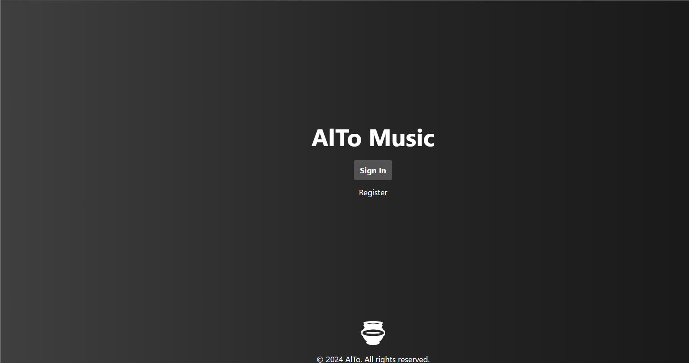
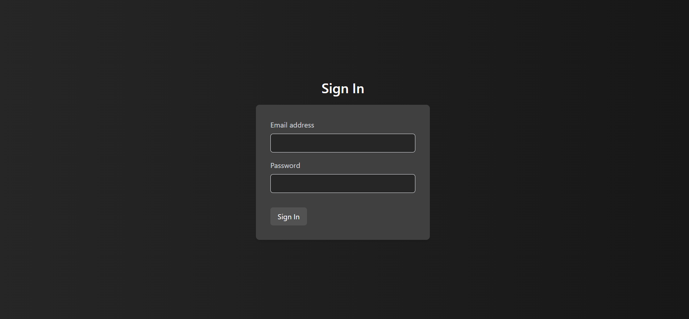
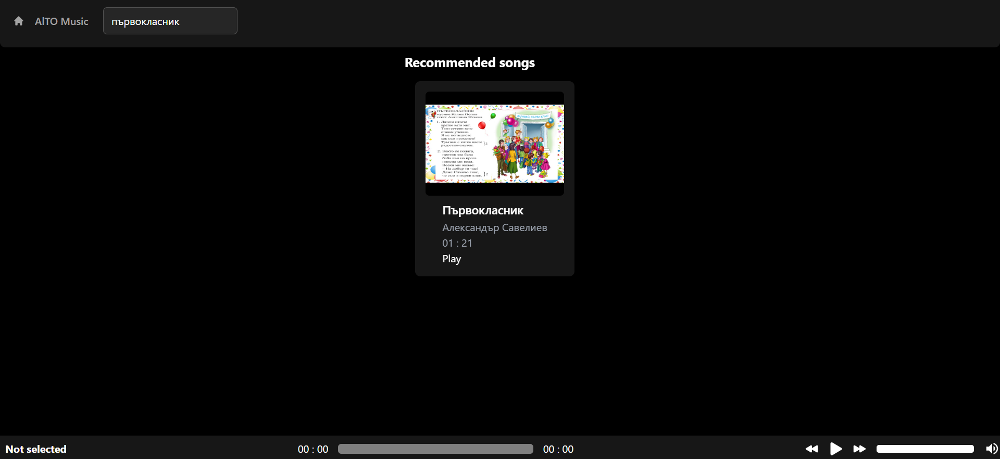

<h1 align="center">AlTo Music</h1>

<h2>📰About</h2>

Целта на <b>проекта</b> ни е да създадем <b>уеб страница</b> съдържаща <b>музиково съдържание</b> което да подобри успешността на <b>учебния процес</b>. Идеята е да се улесни достъпа на учители до файловете, като те могат просто да влязат в нашата уеб страница и да <b>стриймват</b> от там.

<h2>📷Screenshots</h2>

</img>
</img>
</img>

<h2>📃Documents</h2>

<ul>
<li><a href = "https://codingburgas-my.sharepoint.com/:w:/r/personal/tyatanasov21_codingburgas_bg/Documents/%D0%B4%D0%BE%D0%BA%D1%83%D0%BC%D0%B5%D0%BD%D1%82%D0%B0%D1%86%D0%B8%D1%8F%E2%80%93%D0%9D%D0%9E%D0%98%D0%A2.docx?d=w406be594a43349508ae80868a8f9c7d3&csf=1&web=1&e=QIgaTb">Documentation</a></li>
<li>
<a href = "https://codingburgas-my.sharepoint.com/:p:/r/personal/tyatanasov21_codingburgas_bg/Documents/%D0%BF%D1%80%D0%B5%D0%B7%D0%B5%D0%BD%D1%82%D0%B0%D1%86%D0%B8%D1%8F-%D0%9D%D0%9E%D0%98%D0%A2.pptx?d=we5237ca702ab4132b7c730e99878b117&csf=1&web=1&e=Z1V9f2">Presentation<a></li>
</ul>

<h2>🧑‍💻Technologies</h2>
<h3> Code editors and collaborative services used:</h3>

    
    
    
    
    
    

<h3>Programming & markup languages & third party libraries & frameworks:</h3>

    
    
    
    
    
    
    
    
    

<h3>Softwares used for visual elements:</h3>
    
    
<h3>Used program for creating the presentation and documentation:</h3>

   
   

<h2 align = "left">🧒Our team</h2>
<ul>
<li><a href = "https://github.com/TYAtanasov21"> Todor Atanasov </a>[Front-end developer]  </li>
<li><a href = "https://github.com/AZKazakov21"> Alex Kazakov </a> [Back-end developer] </li>
</ul>

<h3 align = "center">Thank you for checking out our repo! If you had a good time you can leave us a ⭐!</h3>